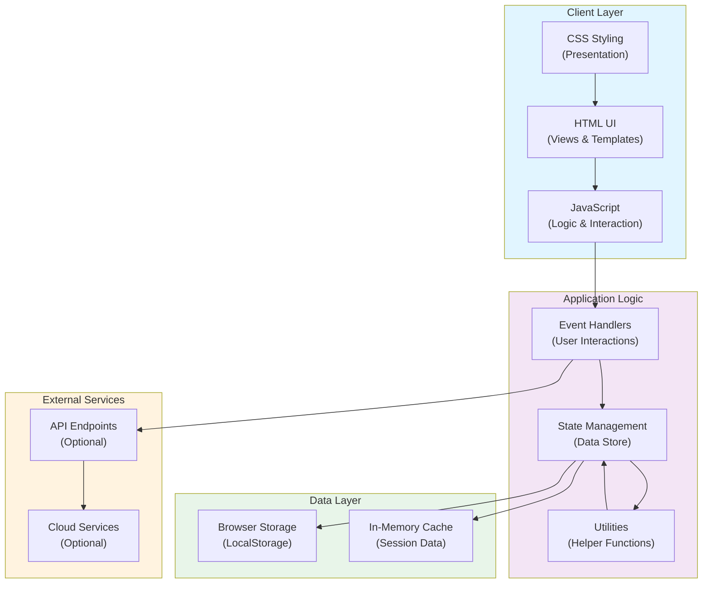

# Architecture Overview

This document provides an architectural overview of the Notes application, a JavaScript-based project with HTML and CSS components.

## System Architecture

## Component Breakdown

### Client Layer
- **HTML UI**: Semantic HTML structure for notes display and interaction
- **CSS Styling**: Responsive design and visual presentation (554 KB)
- **JavaScript**: Core application logic and DOM manipulation (7.7 MB)

### Application Logic
- **Event Handlers**: Capture and process user interactions
- **State Management**: Centralized data and application state
- **Utilities**: Reusable helper functions and common operations

### Data Layer
- **Browser Storage**: Persistent storage using LocalStorage API
- **In-Memory Cache**: Session-based temporary data storage

### External Services
- **API Endpoints**: Optional backend integration
- **Cloud Services**: Scalable data synchronization and backups

## Technology Stack

| Layer | Technology | Size |
|-------|-----------|------|
| Frontend UI | HTML | 2.5 KB |
| Styling | CSS | 554 KB |
| Application Logic | JavaScript | 7.7 MB |
| **Total** | | **8.3 MB** |

## Key Features

- ✅ Client-side note management
- ✅ Persistent storage with LocalStorage
- ✅ Interactive user interface
- ✅ Responsive design
- ✅ Extensible architecture for API integration

## Future Enhancements

- Backend API for cloud synchronization
- User authentication and authorization
- Collaborative editing
- Rich text formatting
- Cross-device sync
